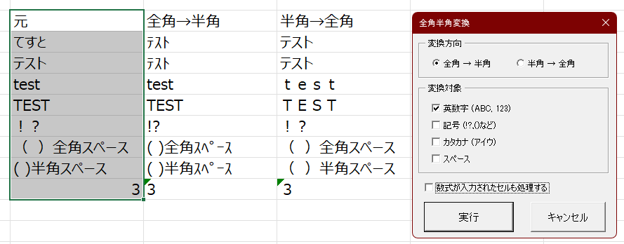

# Excel_VBA_ZenkakuHankakuConverter

## 概要
Excelの選択範囲のテキストを全角から半角または半角から半角に変換します。
PERSONAL.XLSBに保存して動作させることを想定しています。  

## 動作環境
Microsoft Excel上で動作します。  

## インストール方法
1. Contentsフォルダ内のUserForm_SheetRenamer.frm、UserForm_SheetRenamer.frx、シート名一括変更.basを任意の同一フォルダに保存
2. Excelで新規WorkSheetを開く
3. 開発タブのVisual BasicまたはAlt+F11でVBE(Visual Basic Editor)を開く
4. VBAProject一覧からVBAProject (PERSONAL.XLSB)を選択し右クリック
5. ファイルのインポートで保存したUserForm_SheetRenamer.frmを開く
6. 加えてファイルのインポートで保存したシート名一括変更.basを開く
7. 上書き保存ボタンまたはCtrl+Sで保存
以下オプション設定  
8. 任意のExcel WorkSheetに戻り、ファイル→オプション→リボンのユーザー設定の順で遷移
9. 任意のユーザー設定グループ(無ければ新規作成)にPERSONAL.XLSB!起動_シート名一括変更のマクロを追加
10. お好みで名前やアイコンを変更
11. Excel WorkSheetに戻り、設定したマクロのアイコンを選択して起動

## 機能
* Sheet一覧の取得  
  開いているBook内の全Sheetをリスト表示し、対称を選択可能  

* 名称変更方式の選択  
  * 検索・置換：指定文字列を一括置換  
  * プレフィックス追加：Sheet名の先頭に文字列を追加  
  * サフィックス追加：Sheet名の末尾に文字列を追加  
  * 連番付与：連番を自動生成してシート名に付加（桁数・開始番号・増分・位置を指定可能）  
  * 個別指定：各Sheetごとに新しい名前を入力  

* プレビュー機能  
  変更内容を実行前に確認可能

## 連絡先
[Instagram](https://www.instagram.com/nattotoasto?igsh=NWNtdHhnY3A4NDQ0 "nattotoasto")

## ライセンス
MIT License
